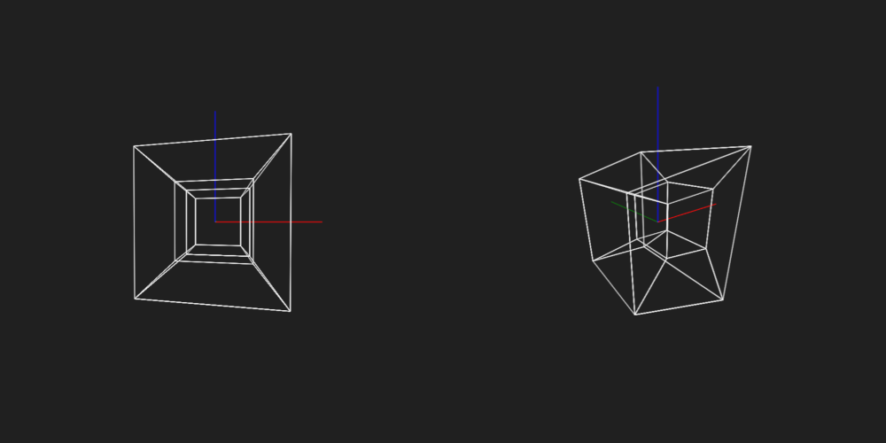

# A rotating tesseract
If you wish to just run the animation, the packed files are in the `dst` folder.

You can view it here: <a href="https://mekina.cz/tesseract/">https://mekina.cz/tesseract/</a>

# Disclaimer
This hyper-advanced tesseract may initially boggle the mind with its 4D gymnastics.
However, prolonged observation from a single angle could lead to a phenomenon called 'dimensional drop' — where the fourth dimension quietly slips away, and you're back to plain old 3D.
Enjoy the ride, but don't be alarmed if your brain decides to stick to what it knows best.

Also... maybe don't look at it for too long, as I don't want anyone to get a seizure.
